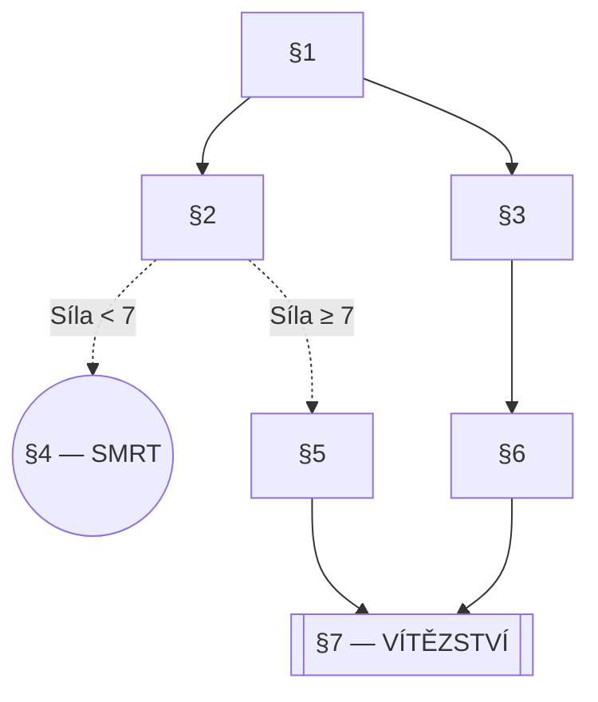

# Gamebook Correction Report Template

Use this exact structure for the output report. Save as a `.md` file.

```markdown
# Korektura knihy-hry: [NÁZEV]

**Datum:** [datum]
**Verze rukopisu:** [verze pokud uvedena]
**Počet odstavců:** [N]
**Počet konců:** [X vítězných, Y smrtelných]

---

## Souhrnné hodnocení

[1–3 paragraphs: Is the gamebook ready for publication? What are the most critical issues?
Rate overall quality: language, mechanics, structure — each on a scale of
✅ v pořádku / ⚠️ drobné problémy / ❌ vyžaduje přepracování]

---

## Jazykové chyby

| # | Odstavec | Původní text | Oprava | Typ |
|---|----------|-------------|--------|-----|
| 1 | §12 | "Rozhodneš-li se jít do leva" | "Rozhodneš-li se jít doleva" | pravopis |
| 2 | §34 | "tvá Odolnost klesne" | "tvá Výdrž klesne" (konzistence s §1) | terminologie |

[Continue for all issues found. Group by severity if list is long.]

---

## Herní mechaniky — problémy

### Kritické
- **§45 — Nepřekonatelný souboj:** Nepřítel má Sílu 14, ale maximum hráče je 12 + kostka (max 6) = 18 vs. nepřítelova obrana 20. Hráč nemůže vyhrát.
  → *Doporučení: Snížit nepřítelovu obranu na 16, nebo přidat útěkovou možnost.*

### Střední
- **§23–§27 — Předmět vyžadován bez cesty k získání:** §27 vyžaduje Klíč ze §15, ale §15 je dostupný pouze z cesty A. Hráči na cestě B se do §27 dostanou bez Klíče → uvíznou.
  → *Doporučení: Přidat alternativní způsob získání Klíče, nebo nabídnout obchvat.*

### Nízké
- **§8 — Triviální test:** "Pokud je tvá Síla 3 nebo více..." — minimální Síla je 4. Test je vždy úspěšný.
  → *Doporučení: Zvýšit práh na 7, nebo test odstranit.*

---

## Strukturální problémy

### Osiřelé odstavce (nedostupné z §1)
- §67, §89 — žádná cesta ze startu k nim nevede.

### Slepé uličky (odstavce bez východu, nejsou koncem)
- §42 — text končí popisem místnosti, ale nenabízí žádnou volbu ani odkaz.

### Rozbité odkazy
- §19 → §99: odstavec §99 neexistuje.
- §55 → §0: odkaz na neplatný odstavec.

### Nekonečné smyčky
- §30 ↔ §31: hráč pendluje mezi dvěma odstavci bez možnosti úniku (chybí úniková podmínka).

### Neřešitelné stavy
- Cesta B (§1→§5→§12→§27): §27 vyžaduje Klíč, který je dostupný jen na cestě A. Hráč uvízne.

### Chybějící vítězná cesta
- [pokud existuje problém, popsat; jinak: "Alespoň jedna vítězná cesta existuje (§1→...→§N)."]

---

## Mapa knihy-hry

[Embed or reference the Mermaid diagram file]



[For large gamebooks, provide zone-level overview + per-zone detail diagrams]

---

## Doporučení

Prioritized list of changes, ordered by impact:

1. **[KRITICKÉ]** Opravit rozbité odkazy §19→§99 a §55→§0.
2. **[KRITICKÉ]** Vyřešit neřešitelný stav na cestě B (§27 bez Klíče).
3. **[STŘEDNÍ]** Vyvážit souboj v §45 — snížit obtížnost nebo přidat únik.
4. **[NÍZKÉ]** Sjednotit terminologii: "Výdrž" místo "Odolnost" v §34, §56.
5. **[NÍZKÉ]** Upravit triviální test v §8.
```
